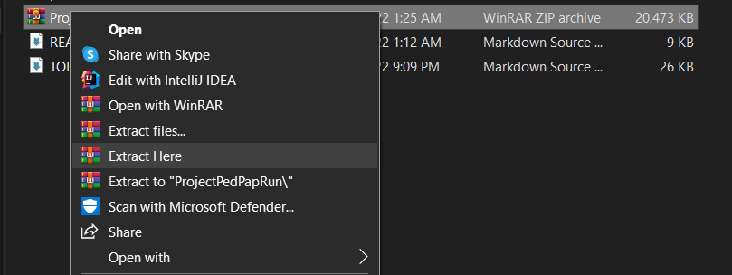
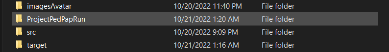
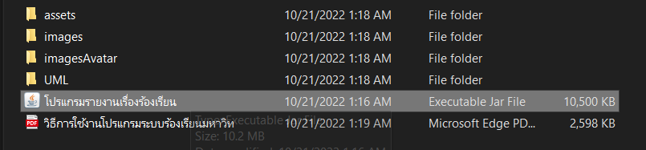

# Project PedPap
## cs211-651-project

## รายชื่อสมาชิก
* 6410450133 นายณพณภัทร นรศรี (nopnapatn)
    * ส่วนของ (GUI) ทั้งหมดยกเว้น แบนและหน้าจัดการเรื่องร้องเรียน
    * ส่วนของ admin (GUI)
    * ส่วนของ staff (GUI)  
    * ส่วนของ user  ทั้งหมดยกเว้น การเรียงข้อมูล และปุ่มรายงาน
* 641045018 นายปริภัทร์ มะลีแก้ว (Pariphatt)
    * ส่วนของ home, login/register/change password (ยกเว้น GUI) 
    * ส่วนของ admin เรื่องรายงานไม่เหมาะสม (ยกเว้นส่วนของเรื่องรายงาน)
    * ส่วนของ staff แยกหมวดหมู่ที่ตัวเองรับผิดชอบ
    * ส่วนของ user  ปุ่มรายงานเรื่องร้องเรียน
* 6410451181 นายพลบุริศน์ แน่งน้อย (Phonburis)
    * ส่วนของ admin ปุ่มลบเรื่องร้องที่ไม่เหมาะสม แบน(GUI)
    * ส่วนของ staff ปุ่มสถานะ หน้าจัดการเรื่องร้องเรียน(GUI)
    * ส่วนของ user  เรียงข้อมูลต่างๆ และ เพิ่มเรื่องร้องเรียน
* 6410450184 นายพลภัทร์ สร้อยเสริมทรัพย์ (phollaphat)
    * ส่วนของ filter + datasource(report/ban/user)
    * ส่วนของ admin เรียงข้อมูลตามเวลา + ระบบแบนผู้ใช้งาน
    * ส่วนของ staff ยกเว้นการเช็คสถานะ
    * ส่วนของ user  ปุ่มรายงานผู้ใช้งาน

## วิธีการติดตั้งหรือรันโปรแกรม
1) คลิกขวาไฟล์ที่ชื่อ ProjectPedPapRun และเลือก Extract Here 

2) ดับเบิ้ลคลิกที่โฟลเดอร์ ProjectPedPapRun

3) ดับเบิ้ลคลิกที่ไฟล์ โปรแกรมรายงานเรื่องร้องเรียน ที่เป็น jar file

## การวางโครงสร้างไฟล์
- assets
    - accounts.csv
    - bannedUsers.csv      
    - reportIssues.csv     
    - reports.csv
    - userIssues.csv
    - votes.csv
- imagesAvatar
    - 2022-10-20_1666271405144.jpg 
    - 2022-10-20_1666281246344.jpg
    - 2022-10-20_1666282436090.jpg
    - 2022-10-20_1666282461814.jpg
    - 2022-10-20_1666282485193.jpg
    - 2022-10-20_1666282507178.jpg
    - 2022-10-20_1666282530265.jpg
    - 2022-10-20_1666282552995.jpg
    - 2022-10-20_1666282576119.jpg
    - 2022-10-20_1666282601386.jpg
    - 2022-10-20_1666282673480.jpg
    - 2022-10-20_1666282695432.jpg
    - 2022-10-20_1666282725060.jpg
    - 2022-10-20_1666282979713.jpg
    - 2022-10-20_1666283000012.jpg
    - 2022-10-20_1666283023985.jpg
    - 2022-10-20_1666283313960.jpg
    - 2022-10-20_1666283340785.jpg
    - 2022-10-20_1666283424903.jpg
    - 2022-10-20_1666283478936.jpg
    - 2022-10-20_1666283553609.jpg
    - 2022-10-20_1666283598934.jpg
    - 2022-10-20_1666283665041.jpg
    - 2022-10-20_1666283690209.jpg
    - 2022-10-20_1666283760936.jpg
    - 2022-10-20_1666283827536.jpg
    - 2022-10-20_1666283865782.jpg
    - 2022-10-20_1666283911098.jpg
    - 2022-10-20_1666283946057.jpg
    - 2022-10-20_1666283982323.jpg
    - 2022-10-20_1666284011729.jpg
    - 2022-10-20_1666284041000.jpg
    - admin1.png
    - admin2.png
    - admin3.png
    - admin4.png
    - profile-staff.png
    - profile-user.png
- src
    - main
        - java
            - com.github.saacsos
            - ku.cs
                - com.github.saacsos.fxrouter-1.0.0
                - controllers
                    - AddReportPageController         
                    - AdminHomePageController         
                    - BannedUserPageController         
                    - ChangePasswordPageController     
                    - CreditPageController             
                    - GuideBookPageController          
                    - HomePageController              
                    - LoginPageController              
                    - ManageReportsPageController      
                    - MyReportPageController        
                    - RegisterPageController         
                    - RegisterStaffPageController    
                    - ReportComplaintPageController    
                    - ReportUserPageController        
                    - ReportUnbanPageController        
                    - RequestUnbanPageController       
                    - StaffHomePageController          
                    - WelcomePageController
                - models
                    - accounts            
                        - Account
                        - AccountList
                        - AdminAccount
                        - StaffAccount
                        - UserAccount
                    - bans                
                        - Banned
                        - BannedList
                    - issues             
                        - UserIssue
                        - UserIssueList   
                    - reposts
                        - Report
                        - ReportList
                        - Vote
                        - VoteList
                    - Mode
                - services
                    - AccountListDataSource
                    - BannedUserListFileDataSource
                    - DataSource
                    - Filterer
                    - ReportFileDataSource
                    - UserListIssueDataSource
                    - VoteDataSource
                - Main
                - ProjectApplication
            - module-info.java
        - resources
            - ku.cs
                - images
                    - arty.jpg
                    - backicon.png
                    - chutter.jpg
                    - eye.png
                    - kulogo.png
                    - kulogo2.png
                    - nat.jpg
                    - neuw.jpg
                    - profile-user.png
                    - test.jpg
                - styles
                - add_report_page.fxml         
                - admin_page.fxml             
                - banned_user_page.fxml    
                - change_password_page.fxml     
                - credit_page.fxml            
                - guide_book_page.fxml       
                - home_page.fxml             
                - login_page.fxml               
                - manage_reports_page.fxml      
                - my_report_page.fxml        
                - register_page.fxml           
                - register_staff_page.fxml      
                - report_complaint_page.fxml   
                - report_user_page.fxml         
                - request_unban_page.fxml       
                - staff_page.fxml               
                - welcome_page.fxml             

## ตัวอย่างข้อมูลผู้ใช้ระบบ
ตัวอย่างข้อมูลผู้ใช้ระบบ
* (Admin)  Username : admin,         Password: 12345ku
* (Staff)  Username : staffone,      Password: staffone1,  หน่วยงาน กองยานพาหนะ
* (Staff)  Username : stafffour,     Password: stafffour4,  หน่วยงาน อาคารและสถานที่ 
* (Staff)  Username : staffseven,    Password: staffseven7,  หน่วยงาน สำนักบริการคอมพิวเตอร์ 
* (Staff)  Username : stafften,      Password: stafften10, หน่วยงาน กองกิจการนิสิต Password: staffone10
* (Staff)  Username : staffthirteen, Password: staffthirteen13, หน่วยงาน สำนักงานทรัพย์สิน  
* (Staff)  Username : staffsixteen,  Password: staffsixteen16, หน่วยงาน สำนักงานอธิการบดี
* (User)   Username : pariphat,      Password:nat123

## สรุปสิ่งที่พัฒนาแต่ละครั้งที่นำเสนอความก้าวหน้าของระบบ
* ครั้งที่ 1 (12 สิงหาคม 2565)
    * นายณพณภัทร นรศรี (ทำหน้า Welcome Page + List Report)
    * นายปริภัทร์ มะลีแก้ว (ทำหน้า Home + Credit + GUI guidebook)
    * นายพลบุริศน์ แน่งน้อย (ทำหน้า Register + show hidden password)
    * นายพลภัทร์ สร้อยเสริมทรัพย์ (ทำหน้า login)

* ครั้งที่ 2 (8 กันยายน 2565)
    * นายณพณภัทร นรศรี (welcome page+vote page + detail report)
    * นายปริภัทร์ มะลีแก้ว (แก้ไข Register+login ให้ใช้งานได้)
    * นายพลบุริศน์ แน่งน้อย (ทำหน้า Admin+ เปลี่ยนรหัสผ่าน + Report ban user)
    * นายพลภัทร์ สร้อยเสริมทรัพย์ (ทำหน้าwelcome_staffแสดงlistviewและmy_account)

* ครั้งที่ 3 (30 กันยายน 2565)
    * นายณพณภัทร นรศรี (welcome page + report + complaint)
    * นายปริภัทร์ มะลีแก้ว (Change password + login + register)
    * นายพลบุริศน์ แน่งน้อย (manage report + thememode + css darkmode)
    * นายพลภัทร์ สร้อยเสริมทรัพย์ (staff home page + show list view)
